<!-- README.md is generated from README.Rmd. Please edit that file -->
MF.matR
=======

This is a repository of tools to be used for analysis of <i>C. elegans</i> behavioral and calcium imaging data. It's a work in progress intened to mate matlab and R functions.

Installation
------------

To use auto registration functions (if you have git set up),
open a Terminal session, and copy/paste or type:

`mkdir ~/git/projects && cd ~/git/projects`

Then paste: 

`git clone https://github.com/SenguptaLab/MF.matR.git`

This will install the latest version of this repository, which you can keep up do date with:

`cd MF.matR && git pull`

Now for each terminal session from within this directory you need to source 1 bash function to make
registration useable:

`source ./install_registration.sh`

Alternatively, you can add this to your .bash_profile to avoid doing this every session

Now you change directory to the folder of videos you'd like to register, then type

`register`

Within R, you can install the recent version of MF.matR from github with:

``` r
devtools::install_github("mikeod38/MF.matR")
```

Calcium imaging analysis
------------------------

Often we want to both analyze Ca2+ imaging data from multiple worms and generate summary plots. Main function for this is plotGCaMP\_multi(). This function imports either matlab- or imageJ analyzed calcium imagaing date from single worms. (use "matlab = FALSE" if you want to use imageJ-processed data)

``` r
library(MF.matR)
library(tidyverse)
theme_set(theme_classic())
CaData <- plotGCaMP_multi(FileFilter = OP50,
                          genotype = N2,
                          cue = glycerol,
                          nls = TRUE,
                          center_on_pulse = 'ON',
                          startPulse = 29.5,
                          endPulse = 60.5,
                          show.plots = FALSE,
                          matlab = TRUE,
                          folderPath = here::here("extdata","Ca_imaging","mat_format"))
#> [1] "/Users/mikeod/git/projects/MF.matR/extdata/Ca_imaging/mat_format"
```

This gives us access to a data file 'CaData', which is a list of two, containing raw data and a plot:

``` r
glimpse(CaData,max.level = 1)
#> List of 2
#>  $ data:Classes 'tbl_df', 'tbl' and 'data.frame':    5 obs. of  4 variables:
#>  $ plot:List of 10
#>   ..- attr(*, "class")= chr [1:3] "ggassemble" "gg" "ggplot"
```

We can look at each individually. First the data:

``` r
CaData$data
#> # A tibble: 5 x 4
#>   animal                      animal_num data                  maxD
#>   <chr>                       <fct>      <list>               <dbl>
#> 1 OP50_ASH_Glycerol_1_reg.mat 1          <tibble [360 × 10]> 1.10  
#> 2 OP50_ASH_Glycerol_2_reg.mat 2          <tibble [360 × 10]> 0.154 
#> 3 OP50_ASH_Glycerol_3_reg.mat 3          <tibble [360 × 10]> 1.17  
#> 4 OP50_ASH_Glycerol_4_reg.mat 4          <tibble [360 × 10]> 0.0832
#> 5 OP50_ASH_Glycerol_5_reg.mat 5          <tibble [360 × 10]> 0.845
```

Notice this is grouped by animal, which comes from the filename, and the raw data is "nested" within the 'data' column. It contains another 10 columns of values, and is 360 rows long (the \# of frames). We can "unnest" the data:

``` r
CaData$data %>% unnest() %>% glimpse
#> Observations: 1,800
#> Variables: 13
#> $ animal          <chr> "OP50_ASH_Glycerol_1_reg.mat", "OP50_ASH_Glyce...
#> $ animal_num      <fct> 1, 1, 1, 1, 1, 1, 1, 1, 1, 1, 1, 1, 1, 1, 1, 1...
#> $ maxD            <dbl> 1.100427, 1.100427, 1.100427, 1.100427, 1.1004...
#> $ genotype        <chr> "N2", "N2", "N2", "N2", "N2", "N2", "N2", "N2"...
#> $ cue             <chr> "glycerol", "glycerol", "glycerol", "glycerol"...
#> $ food            <chr> "OP50", "OP50", "OP50", "OP50", "OP50", "OP50"...
#> $ neuron          <chr> "GCAMP", "GCAMP", "GCAMP", "GCAMP", "GCAMP", "...
#> $ mean_pulse_delF <dbl> -0.002953321, -0.002953321, -0.002953321, -0.0...
#> $ time            <dbl> 0.25, 0.50, 0.75, 1.00, 1.25, 1.50, 1.75, 2.00...
#> $ signal          <dbl> 0.150947481, 0.134068071, 0.135943347, 0.12261...
#> $ fitted          <dbl> 0.112330160, 0.107387355, 0.102485471, 0.09762...
#> $ correction      <chr> "nls", "nls", "nls", "nls", "nls", "nls", "nls...
#> $ delF            <dbl> 0.0415706424, 0.0296340373, 0.0364111980, 0.02...
```

-   So you can access the raw data and do some more interesting things with it.

And the plot:

``` r
CaData$plot
```

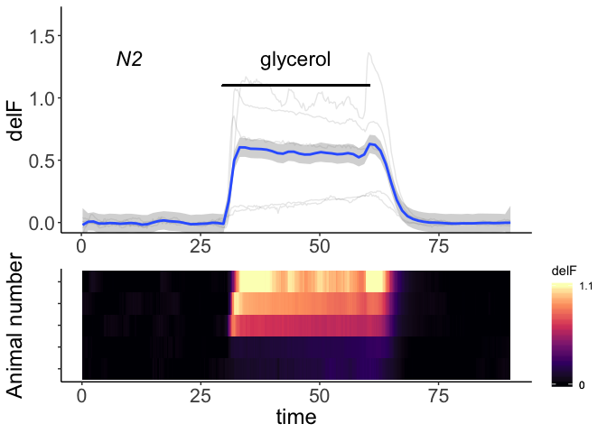

But if we want to plot maximum amplitude, we can do that directly from the data:

``` r
CaData$data %>%
  unnest() %>% 
  group_by(animal, maxD, genotype) %>%
  nest() %>% 
  ggplot(aes(y=maxD, x = genotype)) +
  geom_point() +
  coord_cartesian(ylim = c(0,1.5)) +
  labs(x = "", y = "max DeltaF/F")
```

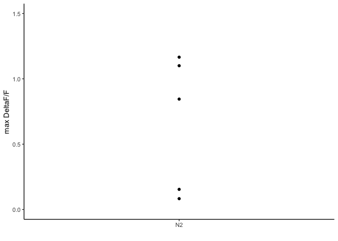

This script attempts to find evidence of bleaching, ie an exponential decay. This works best if using time-points in which there are no responses. By default, the function uses a range defined by "startPulse" and "endPulse". These can be changed.

We can inspect how the correction was done, we can run the plot function, this time with "show.plots = TRUE". This time we'll use imageJ-analyzed data (using matlab = FALSE) to show both the raw pixel values, as well as the background-subtracted values. You can use the raw, non-background-subtracted delta F with "backsub = FALSE".

``` r
plotGCaMP_multi(FileFilter = OP50,
                          genotype = N2,
                          cue = glycerol,
                          nls = TRUE,
                          center_on_pulse = 'ON',
                          startPulse = 29.5,
                          endPulse = 60.5,
                          show.plots = TRUE,
                          matlab = FALSE,
                          folderPath = here::here("extdata","Ca_imaging","imageJ_format"))
#> [1] "/Users/mikeod/git/projects/MF.matR/extdata/Ca_imaging/imageJ_format"
```

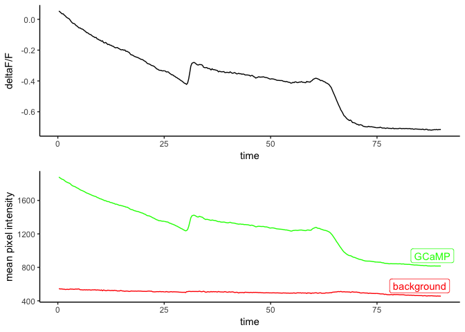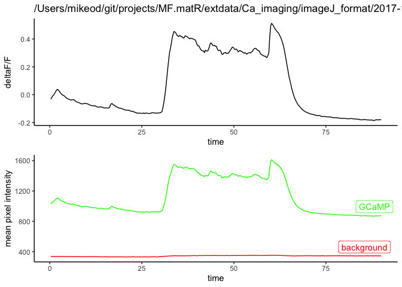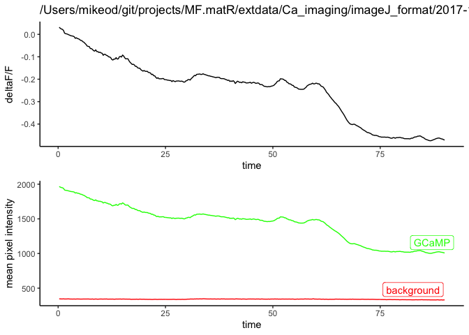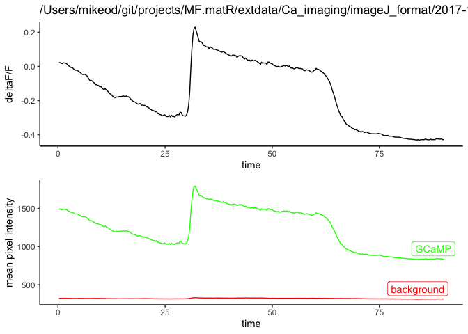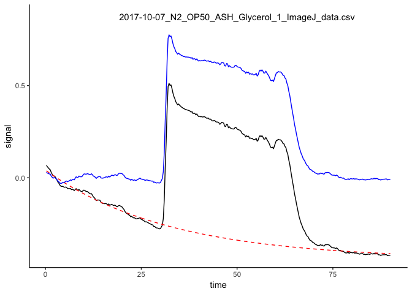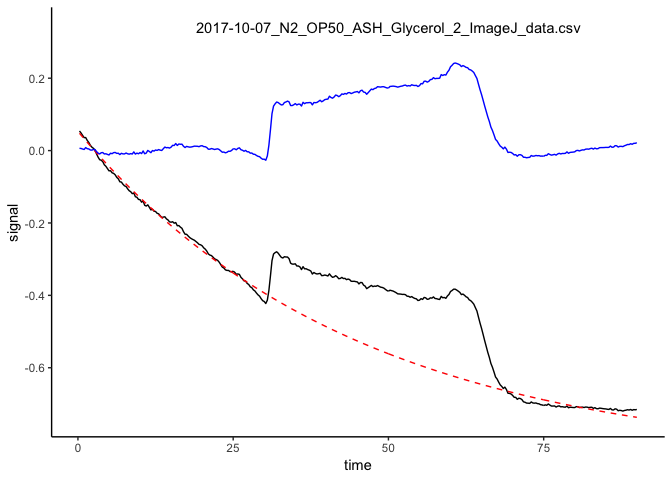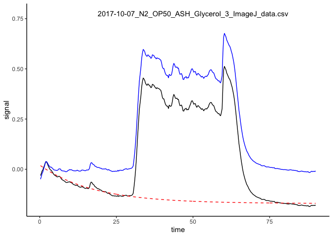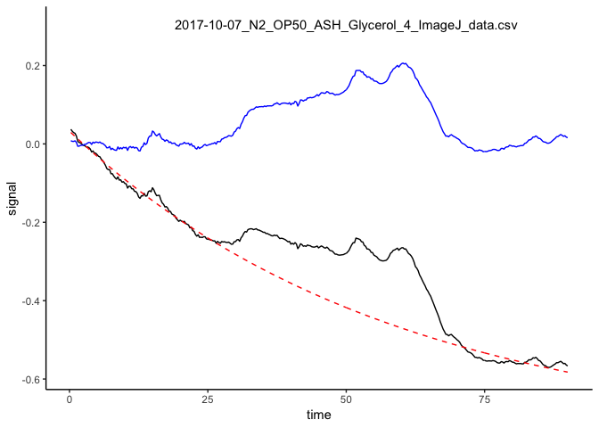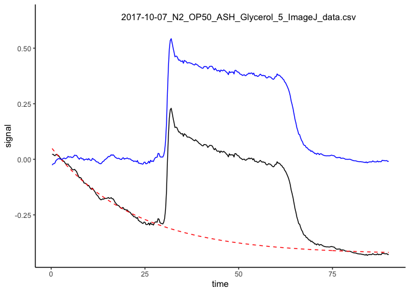

    #> $data
    #> # A tibble: 5 x 4
    #>   animal                                    animal_num data           maxD
    #>   <chr>                                     <fct>      <list>        <dbl>
    #> 1 2017-10-07_N2_OP50_ASH_Glycerol_1/2017-1… 1          <tibble [36… 0.796 
    #> 2 2017-10-07_N2_OP50_ASH_Glycerol_2/2017-1… 2          <tibble [36… 0.146 
    #> 3 2017-10-07_N2_OP50_ASH_Glycerol_3/2017-1… 3          <tibble [36… 0.855 
    #> 4 2017-10-07_N2_OP50_ASH_Glycerol_4/2017-1… 4          <tibble [36… 0.0793
    #> 5 2017-10-07_N2_OP50_ASH_Glycerol_5/2017-1… 5          <tibble [36… 0.672 
    #> 
    #> $plot

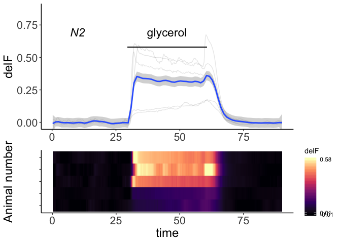
